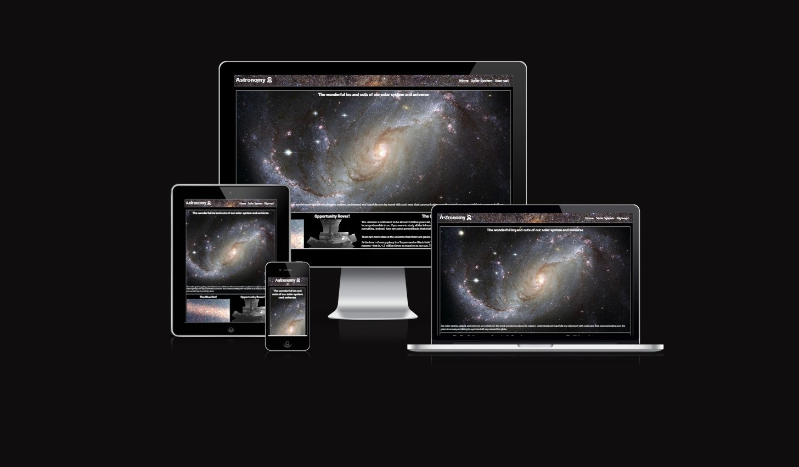

# Astronomy
## Intro

The Astronomy page is an information hub that will be expanded in the future. As of now, people can come to this website and read some interesting facts about the solar system and universe us humans reside in. People who have a broad interest in astronomy can find something here that will catch their eye.

People can simply browse the website of their own accord and if they like whaht they see, can sign up for a weekly newsletting as well as join group astronomy outtings.

## Responsiveness
The site is 100% responsive to all media sizes however, there is plans to impove the look on some devices

## Features
1. The Header/Nav bar
   - The header is the nav bar and allows users to navivate the 3 pages on the site.. the home page, the solar system page and the signup page.
   - Has 2 variations depending on screen size and rotation.
   - has a image as a background that is responsive.

Desktop header/nav image:

Closed header/nav image for mobile phones:

Open:

2. Home Page
   - The home page consists of 2 main section, the hero image with small cover text in order to let the user use the amazing photo. 
   - The content below is interesting information that might make people think 'oh.. I want to know more about that.'
   - The home page is not ideal and needs some polishing for tablet screens and larger.

General mobile look:

General tablet look:

General desktop look:

3. The Solar System Page
   -  The solar system page Showcases the 8 planets of the solar system (theres 9 but lets not talk about that) as well as the moon and the sun. 
   -  information is dispersed in 2 steps, first the image of the object such as the Earth or Mars, and then flipped over is the information. These flip cards are responsive to various screen sizes

Desktop unflipped look:

Desktop flipped look:

4. The Signup Page
   - The signup page not only lets you sign up for a newsletter, but also gives you the option to tailor that email to your interests.
   - There is also an option for people to sign up to an astronomy meet club if they wanted to. More will be added to this part such as information about the meet ups - where they are and what benefits you get from joining.

Desktop signup page:

5. Footer 
   - The footer houses the 4 social media links and exapans evenly depending on screen size.
   - Favicons we're used to style the footer.

Mobile footer img:

## Testing

1. Tested to confirm the website works on all major platforms, Chrome, Firefox, Safari and Microsoft Edge.
2. Tested responsiveness of the site on different screen sizes. Responsiveness was good however tweaks could be made for user experence improvements
3. Lighthouse testing can be hit and miss in regards to performance depending on internet connection and due to the large number of pictures its hard to speed this up. All images that yeilded a lower file size when converted from jpg to webp were used.
4. CSS W3C jigsaw validator found no faults.
5. HTML W3C validator found no faults

### Lighthouse Results

Home:

Solar system:

Signup:

## Deployment

To deploy the project I followed these steps starting from the main project repository [here](https://github.com/Precursorr/Astronomy-Portfolio-1).

 1. On the navigation bar I clicked `settings`.
 2. From there I selected `pages`.
 3. From there I selected the `main` option in the dropdown menu within the `build and deployment` section.
 4. I Selected `save` after this, not touching any other options. After a few moment of waiting I clicked the link to view my page in real time. 
 
## Credits

1. All images we're sourced using [pexels](https://www.pexels.com/) and [pixabay](https://pixabay.com/).
2. All images we're compressed using [FreeConvert](https://www.freeconvert.com/).
3. The flip cards idea was brought to me by my mentor Alan, you can find his git hub [here](https://github.com/Alan-Bushell).
4. I used [w3cschools](https://www.w3schools.com/) and [Stack Overflow](https://stackoverflow.com/) to help me with any parts I was struggling with, such as getting divs to float left from Stack and the flip cards from w3c.
5. The template for this project was souced from [Code-Institute-Org](https://github.com/Code-Institute-Org/ci-full-template) on Github. 

# `Thank you for your time` 
